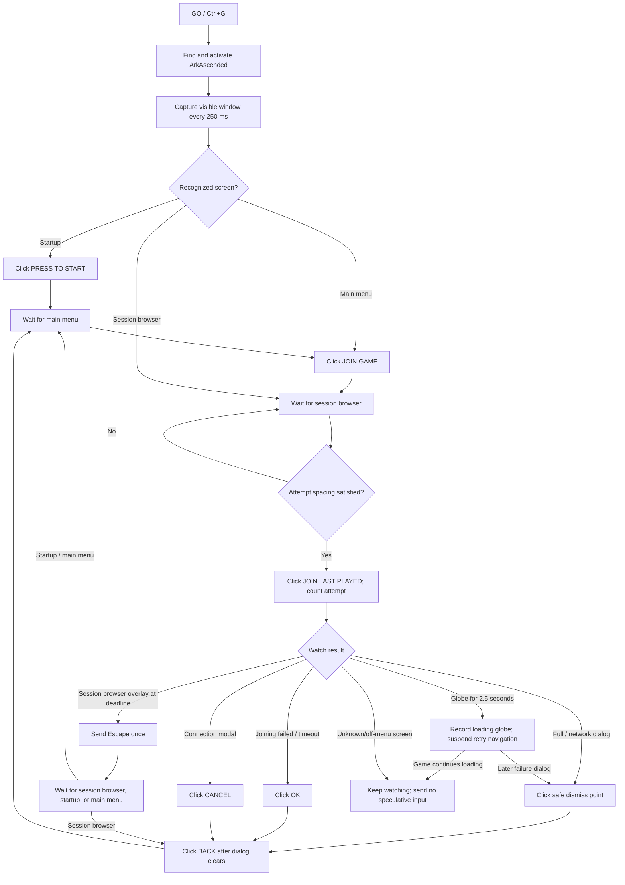
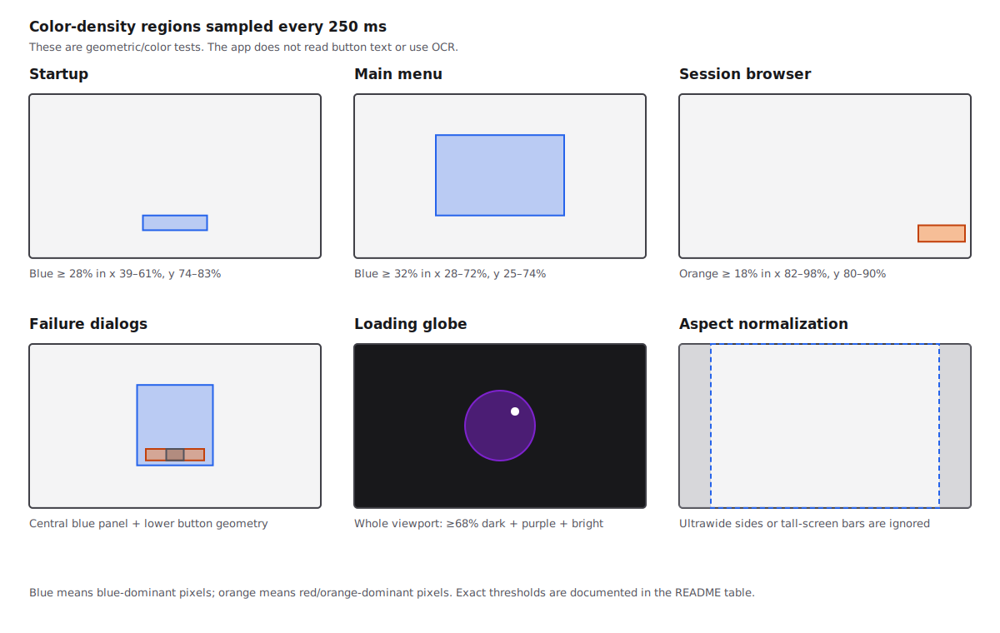
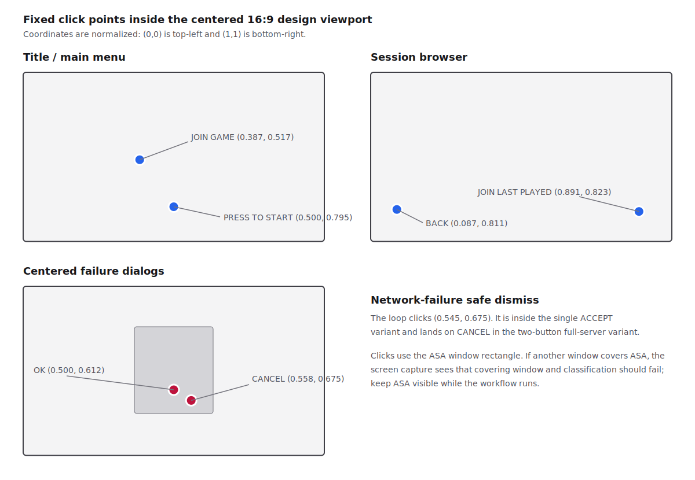

# ARK Join Assist

Current app version: **0.18.1**

A Windows menu helper for ARK: Survival Ascended. Click **GO** or press the global **Ctrl+G** shortcut once and the helper repeatedly tries ASA's last-played server using only the game's visible menus. Press **Ctrl+G** again to stop from anywhere.

No server name, address, API key, console command, or manual menu navigation is required. Choose the desired server in ASA once; subsequent runs use ASA's own last-played selection.

## Download and run

No compilation and no separate .NET installation are required.

1. Download [ARK-Join-Assist-win-x64.zip](https://github.com/jonschr/ark-fix-your-queues/releases/latest/download/ARK-Join-Assist-win-x64.zip) from the latest GitHub Release.
2. Extract the entire ZIP to a normal writable folder, such as `Documents\ARK Join Assist`. Do not run the executable from inside the ZIP.
3. Run `ArkFixYourQueues.exe`.
4. If Windows SmartScreen appears, confirm that the publisher is unknown and choose **Run anyway**. GitHub Release builds are not currently code-signed.

The download is self-contained for 64-bit Windows. Keep the extracted files together; the application executable depends on the other packaged files.

### Automatic updates

The app checks the latest GitHub Release in the background. When a newer version is found, it downloads both the Windows ZIP and its published SHA-256 checksum, verifies the package, and records that the update is ready in the activity log. The app continues running normally.

The verified update installs automatically only after you close the app. A small standalone updater waits for every older app process and transient file lock to clear, replaces the installation files, and restarts the new version. Do not manually relaunch during this swap; the app prevents duplicate running instances. Local settings and delay-performance history are stored under `%LOCALAPPDATA%\ArkFixYourQueues` and are not replaced by updates.

## What the app mechanically does

The app does not read ASA text, inspect game memory, or ask a server service what screen is open. It repeatedly captures the pixels currently visible in ASA's largest window, classifies a few fixed regions by color density, and clicks fixed normalized points only when the current workflow phase permits that action.



### Capture and coordinate system



1. `ArkAscended.exe` is found by process name. The app selects the largest visible top-level window owned by that process and activates it once when **GO** is pressed.
2. Every 250 ms, `CopyFromScreen` captures that window rectangle. This is a picture of what is actually visible on the desktop; another window covering ASA will also cover the captured pixels.
3. The capture is downsampled to 320 pixels wide. Height follows the window aspect ratio and is clamped to 90–320 pixels.
4. Detection and clicks use a centered 16:9 design viewport. Ultrawide captures ignore equal strips on the left and right; taller captures ignore equal strips at the top and bottom. All percentages below are relative to that viewport, not the monitor.

Resolution and monitor count do not directly matter because the app uses ratios inside the ASA window. ASA must remain visible, and major UI layout changes can still matter.

### Exactly what each screen detector looks for

The standard **blue** test means `blue > red + 15` and `green > red + 10`. The stricter dialog-panel blue test uses `+25` and `+15`. **Dark** means `red + green + blue < 150`, sampled every other pixel. None of these rules recognizes words or button labels.

| Classification | Region(s) inside 16:9 viewport | Required visual signal | Guard / consequence |
| --- | --- | --- | --- |
| Session browser | x 82–98%, y 80–90% | At least 18% orange pixels: red > 90, red > 1.25× green, blue < 0.55× red | Checked first. Its orange lower-right control prevents broad blue menu/dialog tests from taking over. |
| Connection/full modal | Central x 37–63%, y 25–75%; lower x 40–60%, y 64–71%; narrow center x 47–53%, y 64–71% | Central panel ≥65% strict blue; whole viewport ≥55% dark; lower band ≥45% blue while its narrow center is <45% blue | Captured as evidence; clicks CANCEL at `(0.558, 0.675)`. |
| Network/full failure | Central x 37–63%, y 25–74%; button x 47–53%, y 64–71% | Central panel ≥68% blue; centered button ≥55% blue; whole viewport ≥55% dark | Only eligible when neither session browser nor connection modal matched. Clicks the shared safe dismiss point at `(0.545, 0.675)`, at most twice while the same dialog remains. |
| Joining failed / timeout | Central x 37–63%, y 28–64%; OK x 43–57%, y 58–64%; lower x 40–60%, y 66–71% | Central panel ≥65% blue; OK band ≥45% blue; lower band <35% blue; whole viewport ≥55% dark | Captured as evidence; clicks OK at `(0.500, 0.612)`. |
| Startup/title | x 39–61%, y 74–83% | At least 28% blue | Ignored when the session-browser detector matched. Clicks PRESS TO START at `(0.500, 0.795)`. |
| Main menu | x 28–72%, y 25–74% | At least 32% blue | Ignored when the session-browser detector matched. Clicks JOIN GAME at `(0.387, 0.517)`. |
| Loading globe | Entire 16:9 viewport | ≥68% very dark pixels (`RGB sum < 105`), ≥0.8% purple pixels, and ≥0.15% bright pixels (`RGB sum > 560`) | Eligible only after a join click and only when no known menu/dialog matched. It must persist for 2.5 seconds before being counted and captured. |



### Phase-by-phase behavior

| Current phase | What the app accepts | What happens next |
| --- | --- | --- |
| Starting | Existing failure dialog, session browser, startup, or main menu | Dismiss the dialog, join immediately from the browser, press through startup, or click JOIN GAME. If nothing matches, the startup point is clicked once as a bootstrap action. |
| Waiting for main menu | Main-menu classifier | Click JOIN GAME. Otherwise keep scanning; after 12 seconds log that the menu is unresolved. |
| Waiting for session browser | Session-browser classifier | Wait for spacing if necessary, then click JOIN LAST PLAYED. Otherwise keep scanning; after 12 seconds log that the browser is unresolved. |
| Waiting for join result | Failure dialogs, loading globe, session browser, or unknown screen | Dialogs are dismissed. A confirmed globe suspends navigation. If the session browser is still detected when attempt spacing expires, send Escape once. An off-menu screen is watched without speculative clicks. |
| Waiting for attempt reset | Session browser, startup, or main menu | After the 250 ms Escape delay, click BACK if the browser remains; otherwise resume from the recognized startup/main menu. |
| Waiting after dialog | Dialog disappearance, then session browser/startup/main menu | Wait at least 650 ms and do not click through a dialog that is still visible. Click BACK at `(0.087, 0.811)` only on the session browser, or resume directly from a recognized menu. |

**Attempt spacing** is both the minimum gap between JOIN LAST PLAYED clicks and the deadline for cancelling ASA's non-authoritative “Joining server...” session-browser overlay. The default is 5 seconds and the allowed range is 0–300 seconds.

The optional recovery scan is first armed four seconds after recognized progress and repeats every five seconds. It only retries positively recognized failure-dialog actions. It does not navigate an unknown screen. At five seconds without recognized progress, the app plays one attention sound; the loop remains running.

### Could ads or small ASA UI changes break this?

Yes, depending on where and how they change the pixels. This implementation is resolution-independent but not layout-independent.

| Change | Likely effect |
| --- | --- |
| Button text, wording, language, server names, or list contents change without moving/recoloring controls | Usually safe; the app does not use OCR. |
| Small animation or ad outside the highlighted detector regions | Usually safe. |
| New orange ad or promotion in the bottom-right session-browser region | Could falsely identify another screen as the session browser. |
| Large blue advertisement/artwork in the central main-menu or startup regions | Could create a false main-menu/startup match or prevent a real match by lowering the blue ratio. |
| Buttons move while retaining the same overall colors | The screen may classify correctly but the fixed click can miss or hit the wrong control. |
| Dialog size, button count, dimming, theme, or color palette changes | Can break one or more failure classifiers because those rules depend on blue density, darkness, and button geometry. |
| Loading artwork becomes less dark, loses purple, or adds/removes bright highlights | Can stop loading-globe detection or create a false globe on similar artwork. |
| Another window covers ASA, ASA is minimized, or a notification overlays a detector region | The capture contains the obstruction; matching becomes unreliable. |

The highest-risk assumptions are the orange JOIN LAST PLAYED area, the broad blue main-menu region, and fixed click positions. When ASA changes its UI, compare the app's latest-screen preview with the two diagrams above and update the normalized regions or click points in `WindowsInterop.cs` and `MainWindow.xaml.cs`.

### Teaching a changed ASA screen

When ASA introduces a screen that the built-in workflow does not recognize, use the **Teach an unfamiliar screen** panel beneath the latest-screen preview:

1. Leave ASA on the unfamiliar screen and start **GO** once so its preview is current.
2. Select what the target does: **Continue / JOIN**, **Back / cancel**, **Confirm / OK**, or **Custom next step**.
3. Click **TEACH THIS SCREEN**, then click the target control in the preview.

The app saves a low-detail visual fingerprint of that layout and the normalized click position in the local Windows profile (`%LocalAppData%\ArkJoinAssist\learned-screens.json`). Built-in state detection always takes priority. A learned click is used only after the current screen does not match a built-in state and its overall layout matches the saved fingerprint; it is rate-limited to one action every three seconds. This makes the learned mapping resilient to animation and rotating art without allowing an unfamiliar screen to receive a speculative click.

## Safety boundaries

- Automation is limited to ASA's visible startup and multiplayer menus.
- The helper reads no game memory, injects no code, manipulates no packets, and does not alter BattlEye or game files.
- Capture failure or the ASA process closing stops the workflow. Unknown screens normally remain under observation, trigger the five-second alert, and receive no input except the one startup bootstrap click made immediately after GO.
- After an attempt, the helper treats ASA's “Joining server...” text as a transient overlay rather than proof of loading. The configured spacing controls cancellation, while recognized failure dialogs and loading globes take priority.
- If no recognized workflow transition occurs for five seconds while running, the helper plays one Windows attention sound and records it in the activity log. Progress re-arms the alert for the next inactive period.
- **Attempt spacing** enforces 0–300 seconds between every actual join click, including retries after menu recovery. It defaults to 5 seconds.
- The latest ASA capture is shown full-width above the activity log and preserves the ASA window's original aspect ratio.
- Recognized error dialogs and confirmed purple-globe loading screens are retained as in-memory screenshot cards in a horizontal session banner, newest first. A globe starts a monitored loading attempt but does not stop the workflow because ASA may still return a post-load server-full error. Ordinary session-browser “loading/joining” messages are not captured. The banner is capped at 60 cards and cleared completely when the app closes; no evidence screenshots are written to disk.
- The activity summary shows attempts, average seconds per attempt, and loading globes in two explicit scopes: the current **GO** session and the lifetime of the currently open app process. Launch-wide average timing pools only intervals between attempts within GO sessions, so stopped time between sessions does not inflate it. Loading-globe yield by configured spacing is tracked separately, persisted across app launches, and ranked in the all-time delay-performance summary.
- Clicking any session-evidence thumbnail opens a large native-aspect preview.
- Clicks and classifier regions are mapped through ASA's centered 16:9 safe UI area, improving compatibility between 16:9, ultrawide, windowed, and differently positioned game windows.
- One second before the inactivity alert, an optional recovery watchdog checks for known OK/Cancel dialogs and takes only positively recognized actions. It repeats every 5 seconds until the workflow progresses, defaults on, and can be disabled before starting.
- The helper performs no gameplay automation.

## Build from source

Maintainers can rebuild with the .NET 8 SDK:

```powershell
dotnet restore
dotnet test -c Release
dotnet publish src\ArkFixYourQueues\ArkFixYourQueues.csproj -c Release -r win-x64 --self-contained true -p:PublishSingleFile=false
```

Pushing a tag such as `v0.13.0` runs `.github/workflows/release.yml`, tests the project, creates the self-contained Windows ZIP and checksum, and publishes both to a GitHub Release. The main WPF application intentionally remains a folder deployment because its earlier single-file build hung on this PC; only the small updater is published as a standalone single file.
